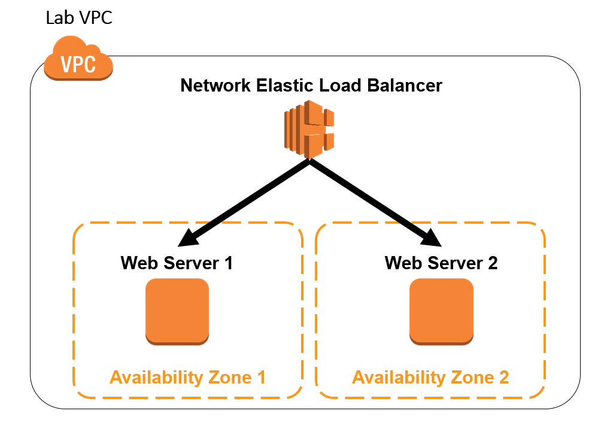
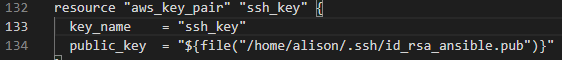
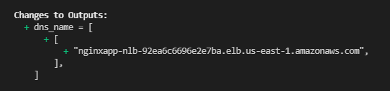
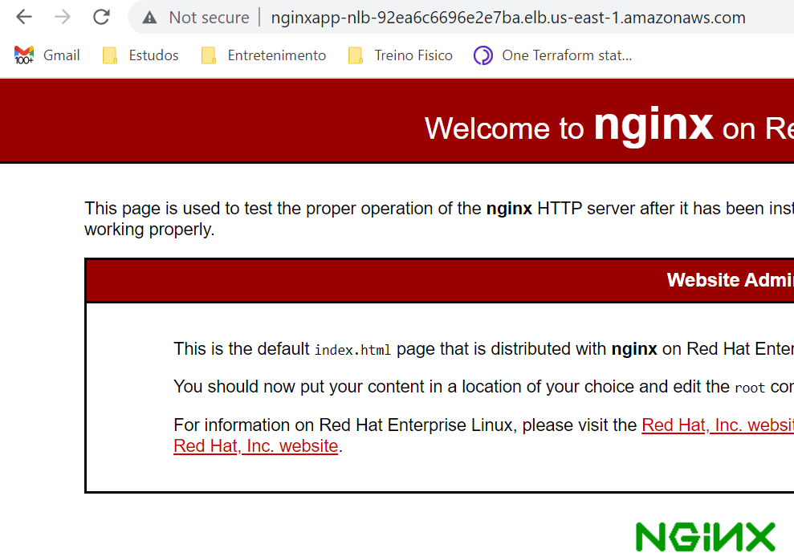

# Teste Técnico - DevOps Enginner

# Infraestrutura!

  - Instance cloud AWS ( by terraform)
  - Nginx Provisionado ( by ansible )

   
 
# Pré-requisitos

A execução desse ambiente foi feito a partir do OS Linux Ubuntu. Abaixo estão as ferramentas necessárias para o provisionamento do ambiente.

  - `terraform`

    Download [Terraform](https://releases.hashicorp.com/terraform/0.12.7/terraform_1.0.2_linux_amd64.zip)

  - `terraform-inventory` 

     Download [Invetory](https://github.com/adammck/terraform-inventory/releases/download/v0.9/terraform-inventory_0.9_linux_amd64.zip)

  - `ansible`

     apt-get install ansible
  

 # Passo a passo
 

- Download do repositorio

   > #git clone https://github.com/guimaraesasp/ec2-nginx.git

- No arquivo vars.tf adicionar as seguintes variavéis referente a conta que será provisionado o ambiente.

  > aws_account_id, access, secret, vpc_id, subnet_private_a e subnet_private_b

- No arquivo main.tf na linha 134 adicionar o caminho da chave privada criada no primeiro passo

- Na raiz do projeto executar comando abaixo para chamar terraform/ansible.

  > #sh infra up

# Acesso

Será exibido o dns name do LoadBalance no output do terraform. Utiliza o dns para acesso a pagina.

